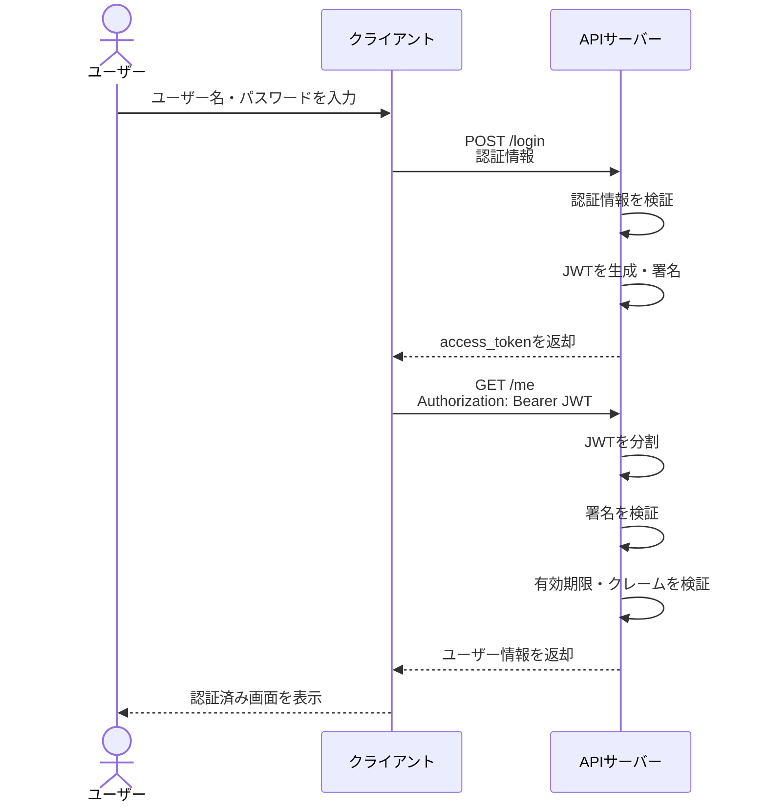
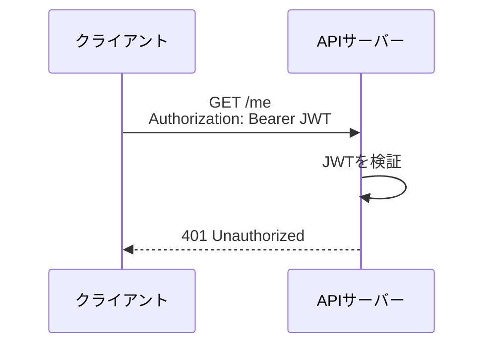
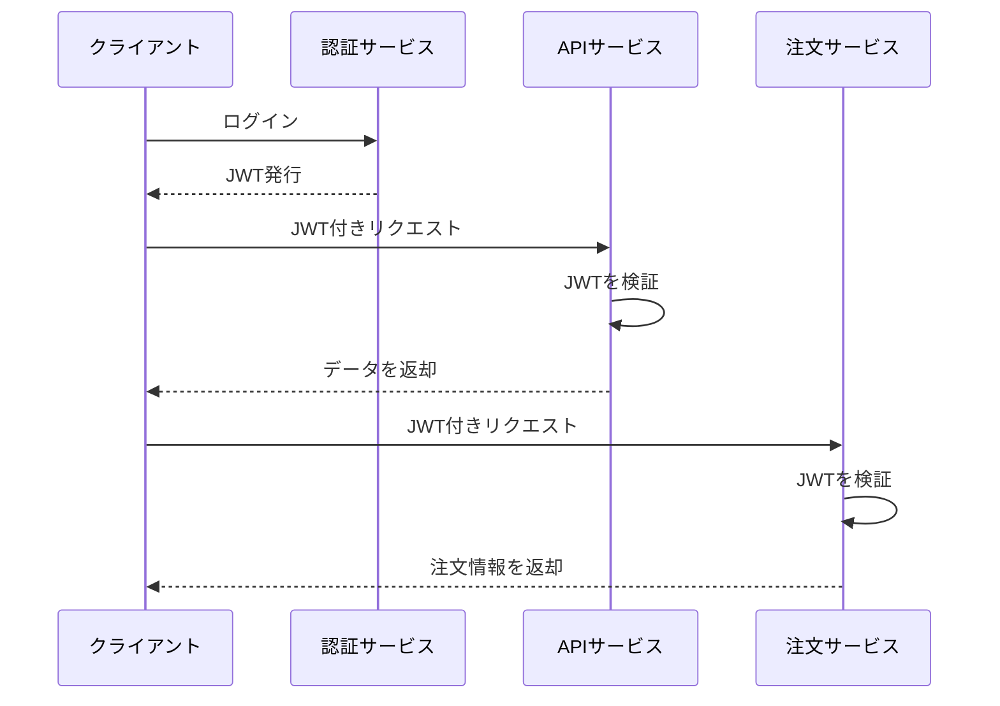
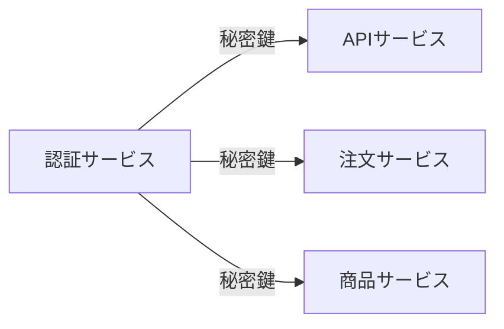
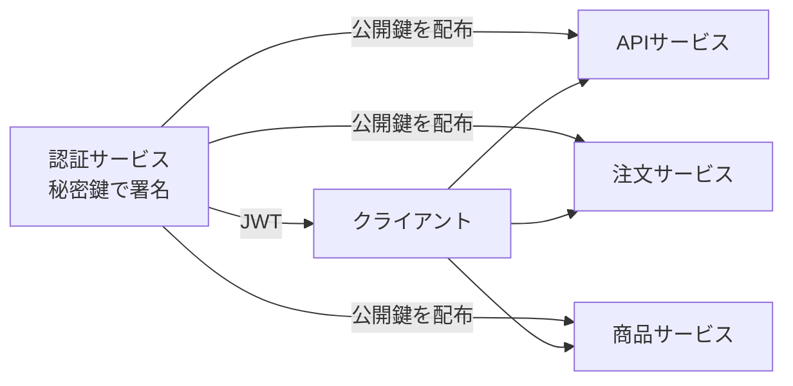

# JWT認証シーケンス

このドキュメントでは、サンプルアプリケーションのログインから、JWTを使ったAPIアクセスまでの流れを説明します。

## 1. JWT認証の全体フロー



## 2. ログイン

クライアントはログイン情報を`POST /login`に送信します。

```http
POST /login
Content-Type: application/json

{
  "username": "alice",
  "password": "password"
}
```

APIサーバーは認証に成功すると、JWTを発行します。

```json
{
  "access_token": "<header>.<payload>.<signature>",
  "token_type": "Bearer"
}
```

## 3. JWTの生成

JWTは次の3つの部分で構成されます。

```text
header.payload.signature
```

### Header

```json
{
  "alg": "HS256",
  "typ": "JWT"
}
```

`alg`は署名アルゴリズム、`typ`はトークンの種類を表します。

### Payload

```json
{
  "sub": "alice",
  "iss": "jwt-sample",
  "iat": 1730000000,
  "exp": 1730000900
}
```

- `sub`: ユーザー識別子
- `iss`: トークンの発行者
- `iat`: 発行時刻
- `exp`: 有効期限

### Signature

このサンプルでは、HeaderとPayloadを連結した値に対して、共有秘密鍵でHMAC-SHA256署名を作成します。

```text
HMAC-SHA256(
  base64url(header) + "." + base64url(payload),
  secret
)
```

## 4. 認証が必要なAPIへのアクセス

クライアントは、取得したJWTを`Authorization`ヘッダーに付けて送信します。

```http
GET /me
Authorization: Bearer <access_token>
```

APIサーバーは次の順番で検証します。

1. `Authorization`ヘッダーからBearerトークンを取り出す
2. JWTが3つの部分に分かれていることを確認する
3. Headerのアルゴリズムが`HS256`であることを確認する
4. 署名を再計算して比較する
5. Payloadを読み取る
6. 発行者と有効期限を確認する

検証に成功した場合、`/me`はユーザー情報を返します。

```json
{
  "message": "authenticated",
  "user": "alice"
}
```

## 5. 無効なJWTの場合



署名が改ざんされている、期限切れ、形式不正、発行者が異なる場合は認証に失敗します。

## 6. セキュリティ上の注意

- JWTのPayloadは暗号化されていないため、パスワードや秘密情報を入れない
- 本番環境では必ずHTTPSを使う
- 署名秘密鍵をソースコードに固定しない
- 有効期限を短く設定する
- 受け入れる署名アルゴリズムをサーバー側で固定する
- 本番ではRefresh Token、トークン失効、鍵の安全な管理も検討する

このサンプルはJWTの仕組みを理解するためのものです。

## 7. ログインするたびにJWTが変わる理由

サンプルでは、ログイン時に次のクレームを生成しています。

```json
{
  "sub": "alice",
  "iat": 1730000000,
  "exp": 1730000900
}
```

`iat`（発行時刻）と`exp`（有効期限）はログインするたびに変わります。Payloadが変わると、Payloadを元に計算する署名も変わるため、JWT全体の値も変わります。

```text
ログイン時刻が変わる
  ↓
iat / exp が変わる
  ↓
署名が変わる
  ↓
access_token全体が変わる
```

JWTは、同じHeader・Payload・秘密鍵からは同じ署名が生成される決定的な仕組みです。毎回必ず異なるトークンにしたい場合は、`jti`（JWT ID）にUUIDなどの一意な値を追加します。

## 8. Payloadとトークンの長さ

JWTは次の3部分を連結したものです。

```text
Base64URL(Header).Base64URL(Payload).Base64URL(Signature)
```

そのため、Payloadにクレームやデータを追加すると、JWT全体も長くなります。Base64URLは暗号化や圧縮ではないため、データ量は基本的に減りません。元データに対しておよそ1.33倍になるのが目安です。

一方、署名の長さはPayloadの大きさに関係なく、HS256なら基本的に一定です。長くなるのは主にPayload部分です。

Payloadは誰でもデコードできるため、パスワードや秘密情報を入れてはいけません。内容を秘匿したい場合は、暗号化されたJWEなど別の仕組みを検討します。

## 9. JWTの保存場所

JWTの保存場所は実装によって異なります。今回のサンプルはJSONレスポンスで返しているだけで、Cookieには保存していません。

```json
{
  "access_token": "<header>.<payload>.<signature>",
  "token_type": "Bearer"
}
```

Cookieに保存する場合は、サーバーが`Set-Cookie`レスポンスヘッダーを返します。

```http
Set-Cookie: access_token=<JWT>; HttpOnly; Secure; SameSite=Lax
```

主な保存方法には次の違いがあります。

| 保存場所 | 特徴 |
| --- | --- |
| HttpOnly Cookie | JavaScriptから読めず、XSSによる盗難に比較的強い。ただしCSRF対策が必要 |
| localStorage | 実装しやすいが、XSSが発生するとトークンを読み取られる可能性がある |
| メモリ | トークンを残しにくいが、ページ更新で消える |

ブラウザ向けアプリでCookieを使う場合は、通常`HttpOnly`、`Secure`、`SameSite`を適切に設定します。

## 10. JWTが使われる場面

JWTは、ログイン済みユーザーであることをAPIに伝えるために使われます。

- Webアプリケーションのログイン認証
- SPA（React、Vueなど）からAPIへのアクセス
- モバイルアプリのAPI認証
- マイクロサービス間の認証
- OAuth 2.0 / OpenID Connectのアクセストークン
- ユーザーIDや権限の受け渡し

ただし、単純なWebアプリでは通常のセッションCookieのほうが扱いやすい場合もあります。JWTは、複数のサービスや異なる種類のクライアント間で認証情報を受け渡す場合に特に役立ちます。

## 11. 複数サービスで便利な理由

複数サービス構成では、各サービスがJWTの署名を検証することで、認証サービスや共通セッションDBへの問い合わせなしにユーザーを認証できます。



セッション方式では、各サービスが共通セッションDBを参照する構成になりやすいです。JWT方式では、サービス間でセッションごとの状態を共有する代わりに、署名を信頼するための鍵を管理します。

## 12. 共通鍵方式と公開鍵方式

### 共通鍵方式（HS256）

HS256では、署名と検証に同じ秘密鍵を使います。



実装は簡単ですが、すべてのサービスが署名を作成できます。1つのサービスが侵害されると、偽のJWTを発行される危険があります。

### 公開鍵方式（RS256 / ES256）

公開鍵方式では、認証サービスだけが秘密鍵を持ち、各サービスは公開鍵で検証します。



- 認証サービスだけがJWTを発行できる
- 各サービスは公開鍵で検証するだけ
- APIサービスが侵害されても、偽JWTを発行しにくい
- サービスごとに秘密鍵を共有しなくてよい

複数サービスでは、一般にRS256やES256などの公開鍵方式が扱いやすい選択肢です。ただし、鍵のローテーション、トークン失効、ログアウト対応は別途必要です。
